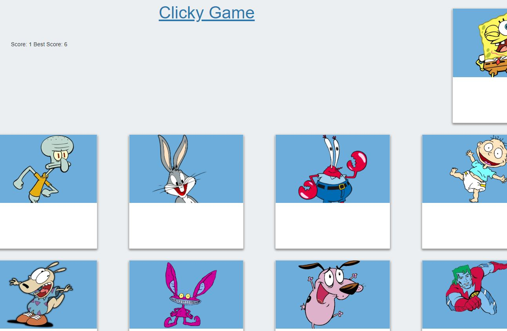

# Clicky Game

## Summary
This is my clicky game web application. This application keeps score as the user clicks on te randomly displayed set of 12 cards. If the user clicks on a card twice, the game is over.  

## Site Pictures


## Technologies Used 
- HTML - Used to create elements on the DOM
- React - JavaScript library for building user interfaces
- Git - Version control system to track changes to source code
- Github - Hosts repository that can be deployed to GitHub pages

## Code Snippet
The following code shows the class component "App." The inital state of the component is set to the friends JSON array. The method "clicked" handles the functionality when a card is clicked. When the card is clicked, using the parameter "id" the clicked key value is updated in the JSON array to true. The cards are then shuffled and displayed again.
```js
class App extends Component {
  // Setting this.state.friends to the friends json array
  state = {
    friends,
    currentscore: 0,
    bestscore: 0
  };

  clicked = id => {
    this.state.friends.find((element, i) => {
      if (element.id === id) {
        if (friends[i].clicked === false) {
          friends[i].clicked = true;
          this.setState({ currentscore: this.state.currentscore + 1 }, function () {
          });
          this.state.friends.sort(() => 0.5 - Math.random())
          return true;
        } else {
          this.endGame();
        }
      }
    });
  }
}
```

The following code shows the FriendCard component. This comonent takes in props to define the image being rendered, as well as calling the method "clicked" when the image is clicked, passing the object's id. 
```js
function FriendCard(props) {
    return (
        <div className="card"  onClick={() => props.clicked(props.id)}>
            <div className="img-container">
                
            </div>
        </div>
    );
}
```

## Author Links
https://github.com/hagoodj